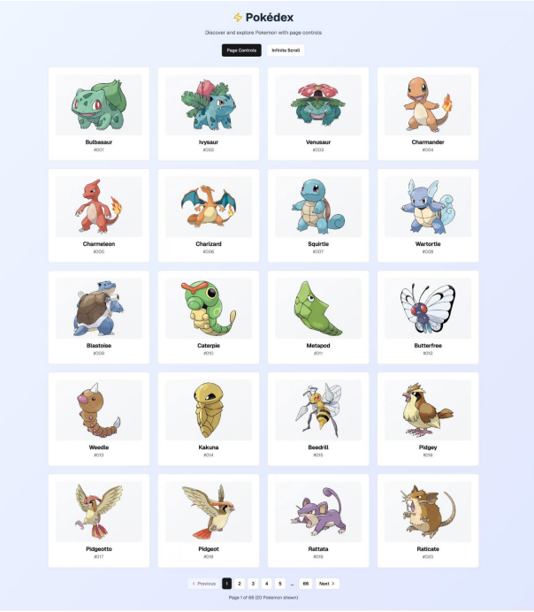
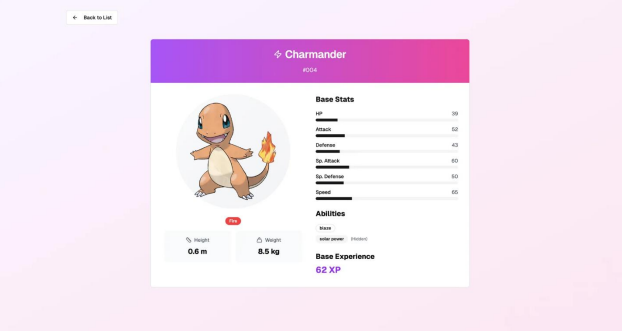

# ⚡ Pokédex Browser

A responsive React + TypeScript Pokédex web application that fetches data from the [PokéAPI](https://pokeapi.co) and allows users to explore Pokémon with two browsing modes: **Pagination** and **Load More (Infinite Scroll)**.

## 🌐 Live Demo

[🔗 View the Deployed App]([https://your-deployment-url.com](https://alaa-habib-pokemon.vercel.app))

## 🚀 Features

- 🐱‍👤 Browse Pokémon using:
  - Pagination controls
  - Load more (infinite scroll)
- 🖼️ Official artwork fetched via PokéAPI
- 🧭 Detail page for each Pokémon (image, stats, abilities, types)
- 🌈 Responsive UI (Grid layout)
- ☁️ Deployed via Vercel / Netlify
- 🧪 Error boundary & loading skeletons

## 📸 Screenshots

| Home | Detail Page |
|------|-------------|
|  |  |

## 🛠️ Tech Stack

- **React** + **TypeScript**
- **Tailwind CSS**
- **React Router**
- **React Query**
- **Vite** (for fast development)
- **PokéAPI** as the data source

## 🧩 Folder Structure

src/
├── api/
│   └── pokemonApi.ts              # API functions for fetching Pokémon data
├── assets/
│   └── react.svg
├── components/                    # Reusable shared UI components
│   ├── ErrorBoundary.tsx
│   ├── ErrorMessage.tsx
│   ├── Loader.tsx
│   └── ModeSwitch.tsx
├── features/
│   ├── details/                   # Pokémon detail page and its subcomponents
│   │   ├── components/
│   │   │   ├── PokemonAbilities.tsx
│   │   │   ├── PokemonDetailSkeleton.tsx
│   │   │   ├── PokemonHeader.tsx
│   │   │   ├── PokemonImageAndTypes.tsx
│   │   │   ├── PokemonPhysicalInfo.tsx
│   │   │   └── PokemonStats.tsx
│   │   └── PokemonDetailPage.tsx
│   └── home/                      # Home page with list view, pagination & load more
│       ├── components/
│       │   ├── LoadMoreButton.tsx
│       │   ├── PaginationControls.tsx
│       │   ├── PokemonCard.tsx
│       │   ├── PokemonList.tsx
│       │   └── PokemonSkeletonCard.tsx
│       ├── hooks/
│       │   └── usePokemonList.ts
│       └── HomePage.tsx
├── App.tsx
└── main.tsx

## ⚙️ Installation & Setup
# 1. Clone the repository
git clone https://github.com/AalaaHabib/Pok-mon-browser.git
cd Pok-mon-browser

# 2. Install dependencies
npm install

# 3. Start development server
npm run dev

